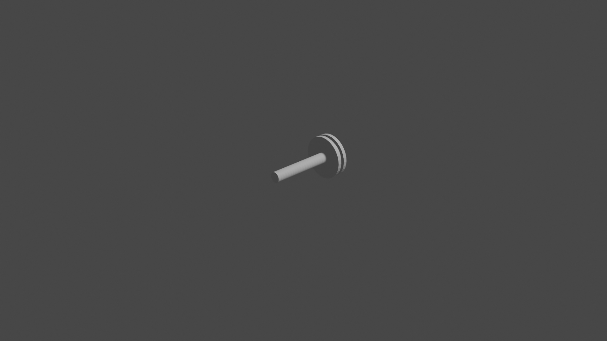
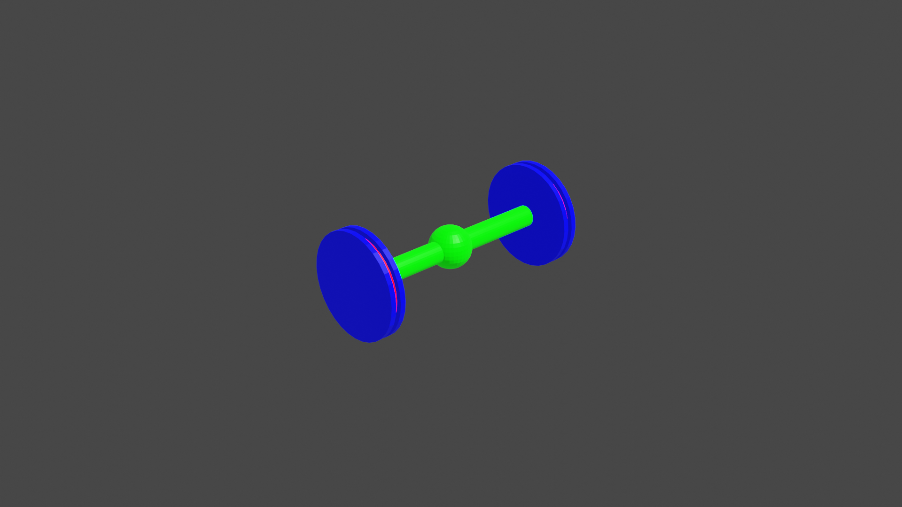
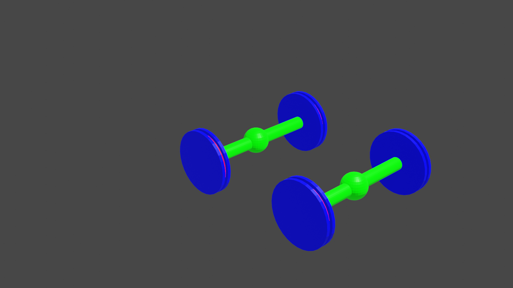
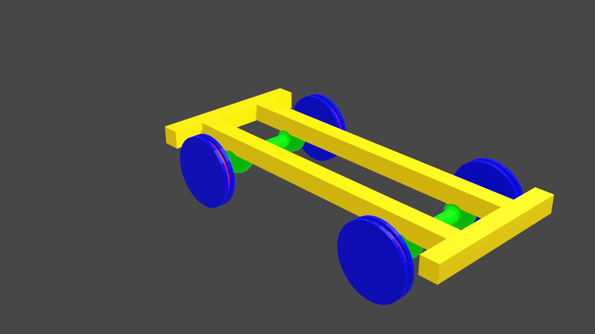
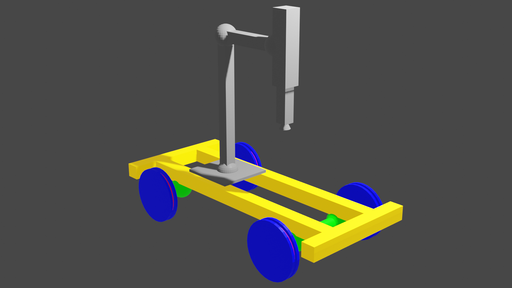
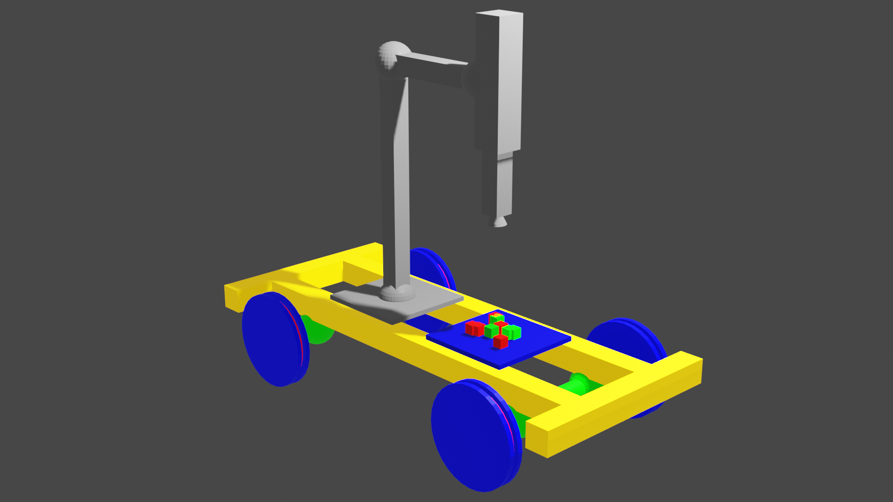
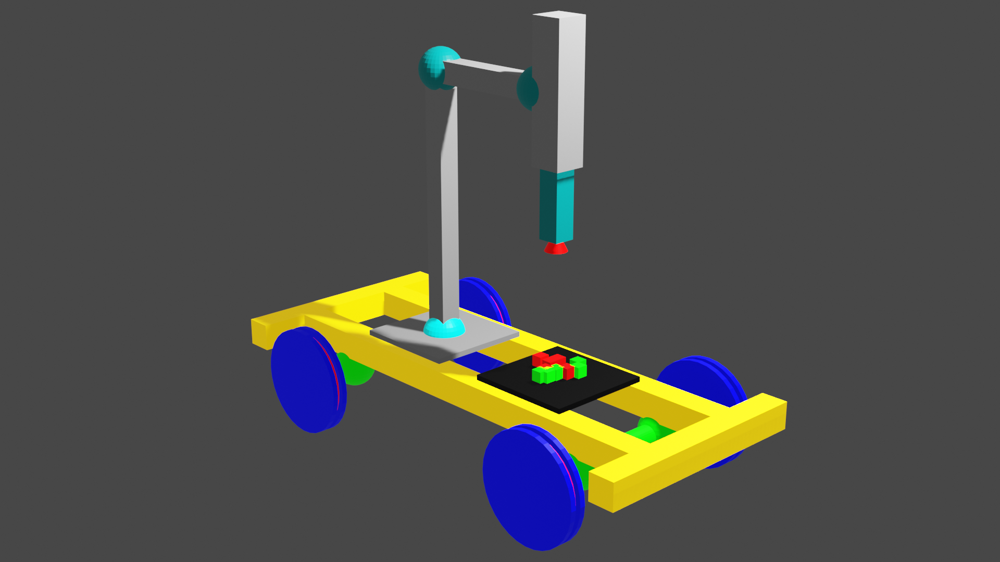

# proyecto-modelado3d-angelobarra

# Día 1:

Partiendo de la idea del eje con dos ruedas que hicimos en clase usando Blender mediante el entorno gráfico, decidí implementar dicha figura usando scripts. Conseguí diseñar de forma muy sencilla, un cilindro que haría de eje y una rueda con canal. 

# Día 2:

Siguiendo con el intento de diseñar un eje, conseguí unir las tres piezas que conforman una rueda, dandoles dos texturas diferentes. Teniendo esto es una función parametrizada con posición en el eje x e y, añadí otra rueda. Además agregué en el eje una esfera que se podría considerar como un diferencial. Una vez teniendo las tres ruedas y el eje, los uní obteniendo el siguiente resultado:

Una vez tuve un eje con sus ruedas agregué otro eje para tener cuatro ruedas en total. 

Una vez tengo estas 4 ruedas tengo que decidir que les agregaré para tener un robot modelado que pueda resultar útil

# Día 3:

Decidí añadirle al robot una estructura compuesta de 4 vigas, siendo 2 vigas paralelas en perpendicular a los ejes y las restantes en paralelo a los ejes, que pueden ser últiles para colocar sensores o alguna placa como un arduino con baterías.

# Día 4:

Por un escenario que se comento en otra asignatura, en la que un robot cogía bolas de una habitación y la llevaba a otra, decidí agregarle al modelo un brazo robótico con una ventosa para que fuese capaz de coger bloques y ponerlos en una zona específica del robot o viceversa. 

Para ello, use 3 esferas que hacen de joints y 4 cubos que hacen de links, de los cuales el último es prismático.

También agregue una bandeja con unos cubos que el robot podría coger y ponerlos en el suelo.

El último paso fue agregarle texturas al brazo obteniendo el siguiente resultado final.

